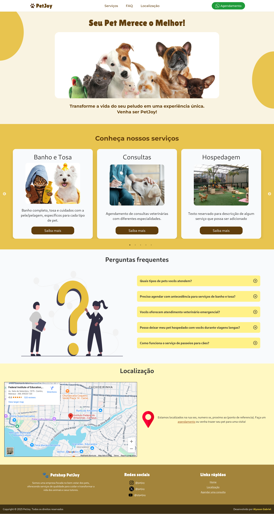

# 🐾 PetJoy - Landing Page de Petshop


## 📌 Descrição

PetJoy é uma landing page responsiva voltada para um petshop fictício. O projeto tem como objetivo oferecer uma interface clara, moderna e amigável para apresentar os serviços, localização e formas de contato da empresa.


## 📷 Demonstração




## 🚀 Funcionalidades

- Layout moderno e responsivo
- Seções: Sobre nós, Serviços, Localização, Contato
- Carrossel para visualização dos cards (serviços)
- Footer com redes sociais e links rápidos
- Design adaptado para dispositivos móveis


## 🛠️ Tecnologias utilizadas

- 
- 

---

## 📦 Como rodar o projeto
1. Clonar o repositório:
```bash
git clone https://github.com/alyssongab/petjoy.git
cd petjoy
```

2. Instalar as dependências
```bash
npm install
```

3. Rodar o projeto
```bash
npm run dev
``` 